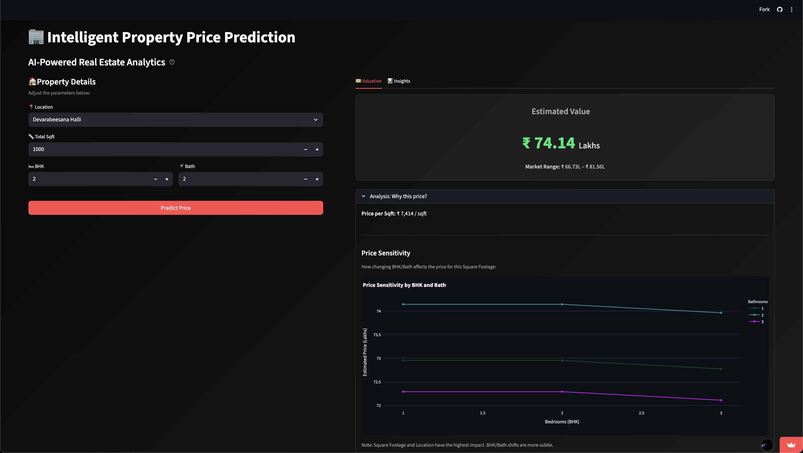
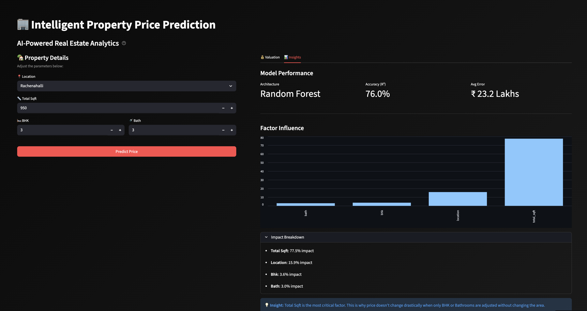
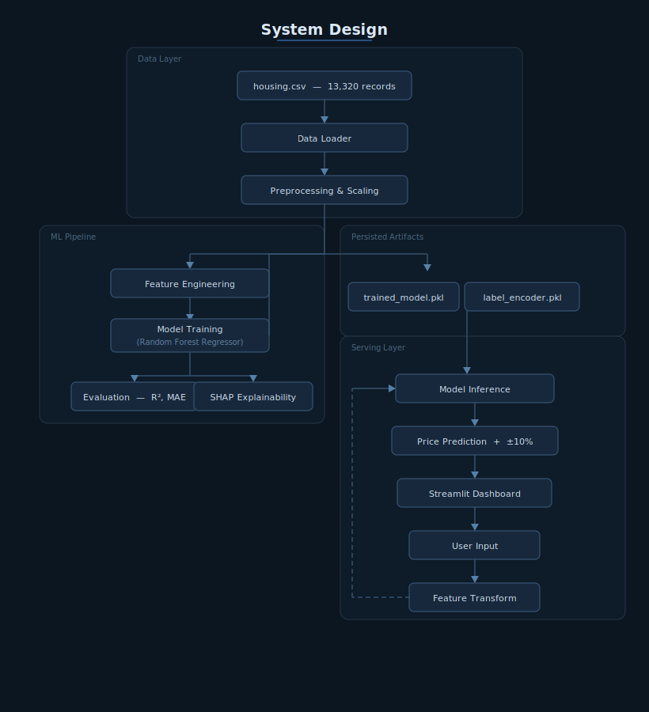

# 🏙️ GeoVal — AI-Powered Real Estate Valuation Platform

<div align="center">


<br/>


**Institutional-grade property valuations powered by Random Forest ML**

[Features](#-features) • [Installation](#-installation) • [Usage](#-usage) • [Architecture](#-high-level-architecture) • [Roadmap](#-roadmap)

</div>

---

## 📖 Project Description

**GeoVal** is an intelligent real estate valuation platform that leverages machine learning to deliver accurate property price predictions for Bangalore's housing market. Built with a Random Forest Regressor trained on 13,000+ property listings, GeoVal provides instant valuations with 76% R² accuracy and a mean absolute error of ₹23.2 Lakhs.

The platform combines comprehensive data engineering (outlier removal, feature engineering, label encoding) with an intuitive Streamlit interface to serve investors, developers, and real estate advisors. GeoVal covers 240+ micro-markets across Bangalore and delivers predictions in under 5 seconds with ±10% confidence bands.

**Key Differentiators:**
- 🎯 Production-grade ML pipeline with proper train/test split validation
- 📊 Interactive price sensitivity analysis with multi-dimensional visualizations
- 🏙️ Granular location encoding for neighborhood-level precision
- 🚀 Real-time valuation with market-range estimates (low/high bounds)

---

## Screenshots




<br/>




## 🌐 Live Services

| Layer        | Platform   | Link                        |
|--------------|------------|-----------------------------|
| Application  | Streamlit  | [https://yash990-bit-gen-ai---capstone-app-hrepbz.streamlit.app/]
| Repository   | GitHub     | [Gen-AI---Capstone](https://github.com/Yash990-bit/Gen-AI---Capstone) |

---

## 📁 Repository Structure

```
Gen-AI---Capstone/
├── app.py                          # Main Streamlit application
├── requirements.txt                # Python dependencies
├── README.md                       # Project documentation
├── assets/
│   └── style.css                   # Additional styling assets
├── data/
│   └── housing.csv                 # Bangalore housing dataset (13,320 records)
├── models/
│   ├── trained_model.pkl           # Serialized Random Forest model
│   ├── label_encoder.pkl           # Location label encoder
│   └── columns.pkl                 # Feature column names
└── notebook/
    └── EDA_and_training.ipynb     # EDA, feature engineering & model training
```

---

## 🛠️ Tech Stack

### **Core Technologies**
- **Python 3.8+** — Primary language
- **Streamlit** — Interactive web application framework
- **scikit-learn** — Machine learning (Random Forest Regressor)
- **Pandas** — Data manipulation and cleaning
- **NumPy** — Numerical computing

### **Libraries & Tools**
- **Plotly** — Interactive visualizations (price sensitivity charts)
- **Matplotlib** — Static plotting for notebooks
- **Seaborn** — Statistical data visualization
- **Pickle** — Model serialization

---

## 🏗️ Architecture



**Flow:**
1. **Data ingestion** from `housing.csv`
2. **EDA & feature engineering** in `EDA_and_training.ipynb`
3. **Model training** (Random Forest) with 76% R² accuracy
4. **Artifact serialization** to `models/` directory
5. **Streamlit app** (`app.py`) loads artifacts on startup
6. User inputs property details → model predicts price → results displayed with confidence bands

---

## ✨ Features

### **AI Valuation Engine**
- ⚡ Sub-second property price predictions
- 🎯 76% R² accuracy (mean absolute error: ₹23.2 Lakhs)
- 📍 Coverage across 240+ Bangalore micro-markets
- 🔄 ±10% confidence interval (market low/high estimates)
- 📊 Price per square foot calculation

### **Interactive UI**
- 🏠 Four-page navigation (Home, Dashboard, AI Valuation, Analytics)
- 🎨 Modern dark-themed interface with emerald accent colors
- 📱 Responsive layout optimized for wide screens
- 🔧 Sidebar-based property configuration (location, sqft, BHK, bathrooms)

### **Market Intelligence**
- 📈 Price sensitivity analysis (BHK/Bath configuration impact)
- 🧠 Feature importance breakdown (location, sqft, BHK, bath)
- 📉 Interactive Plotly charts with hover data
- 🏘️ Location-specific market dynamics

### **Data Engineering**
- 🧹 Automated outlier removal using mean ± 1 standard deviation
- 🔄 Range-to-numeric conversion for square footage
- 🏷️ Label encoding for 242 location categories
- ✂️ Filtering for minimum viable properties (300 sqft per BHK)

### **Platform Capabilities**
- 💾 Cached model loading for performance optimization
- 📊 Comprehensive dashboard with KPI metrics
- 🔍 Feature importance visualization (bar charts)
- 🗺️ Geospatial market structure insights

---

## 🚀 Installation

### **Prerequisites**
- Python 3.8 or higher
- pip package manager
- Virtual environment (recommended)

### **Setup Instructions**

1. **Clone the repository**
   ```bash
   git clone https://github.com/Yash990-bit/Gen-AI---Capstone.git
   cd Gen-AI---Capstone
   ```

2. **Create virtual environment** *(optional but recommended)*
   ```bash
   python -m venv venv
   source venv/bin/activate  
   ```

3. **Install dependencies**
   ```bash
   pip install -r requirements.txt
   ```

4. **Train the model** *(if model files don't exist)*
   
   Open and run `notebook/EDA_and_training.ipynb` to:
   - Load and clean the housing dataset
   - Perform feature engineering
   - Train the Random Forest model
   - Serialize artifacts to `models/` directory

   **Expected outputs:**
   - `models/trained_model.pkl`
   - `models/label_encoder.pkl`
   - `models/columns.pkl`

5. **Verify installation**
   ```bash
   python -c "import streamlit; import sklearn; import plotly; print('✅ All dependencies installed')"
   ```

---

## ⚙️ Environment Variables

This project does not require environment variables. All configurations are hardcoded or derived from the dataset.

**Optional Customizations** (modify in `app.py`):
- `st.set_page_config()` — Page title, icon, layout
- Model paths in `load_artifacts()` function
- Dataset path in notebook (currently `../data/housing.csv`)

---

## 📘 Usage Guide

### **Running the Application**

1. **Start the Streamlit server**
   ```bash
   streamlit run app.py
   ```

2. **Access the application**
   - Default URL: `http://localhost:8501`
   - The app will automatically open in your browser

### **Navigation**

**Home Page:**
- Platform overview and feature showcase
- Quick CTA to start valuation

**Dashboard:**
- Model performance metrics (R² score, MAE, market coverage)
- Feature importance visualization
- Model health summary

**AI Valuation:**
- Configure property details in sidebar:
  - Location (dropdown of 242+ areas)
  - Total square footage (300-10,000 sqft)
  - BHK (1-10 bedrooms)
  - Bathrooms (1-10)
- Click "Generate Valuation" to get:
  - Predicted price (Lakhs)
  - Market low/high estimates
  - Price per square foot
  - Price sensitivity chart (BHK/Bath variations)

**Analytics:**
- Detailed feature importance breakdown
- Model architecture insights
- Performance benchmarks

### **Example API Usage** *(programmatic access)*

```python
import pickle
import numpy as np


model = pickle.load(open('models/trained_model.pkl', 'rb'))
label_encoder = pickle.load(open('models/label_encoder.pkl', 'rb'))

location = 'Whitefield'
total_sqft = 1200
bath = 2
bhk = 3

loc_encoded = label_encoder.transform([location])[0]
features = np.array([[loc_encoded, total_sqft, bath, bhk]])

prediction = model.predict(features)[0]
print(f"Predicted Price: ₹{prediction:.2f} Lakhs")
```

### **Running Tests**

No formal test suite is included. To validate the model:

1. Open `notebook/EDA_and_training.ipynb`
2. Run all cells to see:
   - Model accuracy: **76.04% R²**
   - Mean absolute error: **₹23.26 Lakhs**

---

## 🗺️ Roadmap

### **Planned Features**
- [ ] Add user authentication for saved valuations
- [ ] Implement historical price trend analysis
- [ ] Integrate map-based location selector (Folium/Google Maps)
- [ ] Support for comparative market analysis (CMA)
- [ ] Add PDF report generation for valuations
- [ ] Expand to other Indian metro cities (Mumbai, Delhi, Pune)
- [ ] Build REST API for external integrations
- [ ] Add model retraining pipeline with updated data

### **Known Issues**
- Location dropdown can be slow with 240+ options (consider search/autocomplete)
- Model doesn't handle locations outside training data gracefully
- No mobile optimization (layout is wide-screen focused)
- Price sensitivity chart legends can overlap with small screen sizes

### **Technical Debt**
- Refactor CSS from inline to external stylesheet (`assets/style.css`)
- Add logging for prediction errors
- Implement model versioning system
- Add data validation for user inputs

---

## 👥 Authors / Main Contributors

### **Main Contributors**
- **Yash** — [@Yash990-bit](https://github.com/Yash990-bit)
- **Om** — [@Yash990-bit](https://github.com/Silence91169)

---

## 📄 License

This project is licensed under the MIT License.

---

## 🙏 Acknowledgments

- Dataset sourced from Bangalore housing market data
- Built with [Streamlit](https://streamlit.io/) framework
- ML powered by [scikit-learn](https://scikit-learn.org/)
- Visualizations via [Plotly](https://plotly.com/)

---

<div align="center">

**[⬆ Back to Top](#-geoval--ai-powered-real-estate-valuation-platform)**

Made with 💚 by the GeoVal Team

</div>
